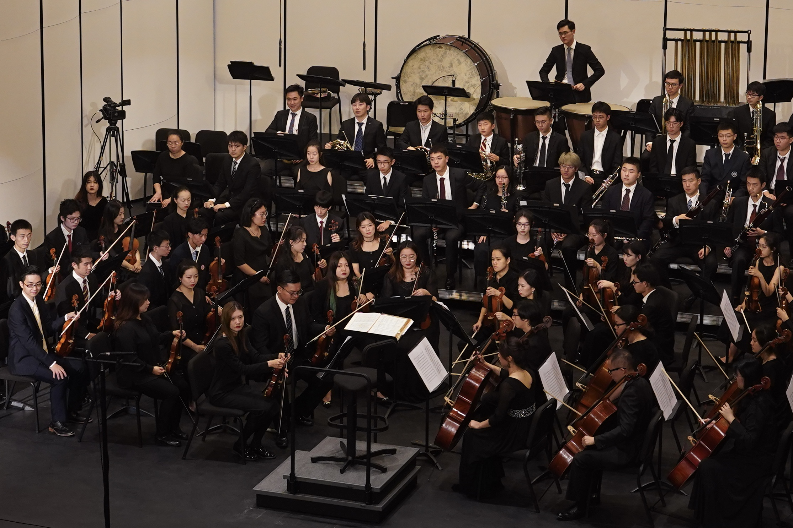

I was 4 yrs old when I started on the violin on 14th July 2002 (thanks to my mother of having a notebook to write down the progress and problems after each lesson), and took the first viola lesson in July 2009. There are endless reminiscences flashing through my mind now and omg I just can’t imagine it’s been 20 years. 

I’ve got two admirable violin teachers and one viola teacher. Two of them are in their 70s but they act not only as a skillful and professional teacher, but we also surprisingly became good friends after class. They taught me how to respect and show the power of women.

An useful takeaway during these 20 years is, when you are feeling stuff, and you are got to hold on to that. I met several plateaus when learning the violin, during which stress came from the intensive academic study at school and the hardship in improving playing skills. My mother saw my struggles at these times and helped me to clear my thoughts. Her talks with me reminded me of my primitive interests in music and her supports helped me pull through the difficult time. 

 

20 years till now, music builds up my tenacity, which benefits many aspects of my life. I feel more courageous when I encounter challenges and I walk out the area where the only obstacles and barriers are set by the fear of difficulties and changes and second guess of oneself. I understand what it really means to try the best and let it be, which unburdens my unnecessary concerns and encourages me to spare no efforts.

So, my greatest musical hero, though, was my mom, who sacrificed so much to my musical education. She’s always been the biggest believer in me, and I wouldn’t be where I am today without her. Love you mom!

 

### Thankful for every part of this journey.
### 20 and fabulous!