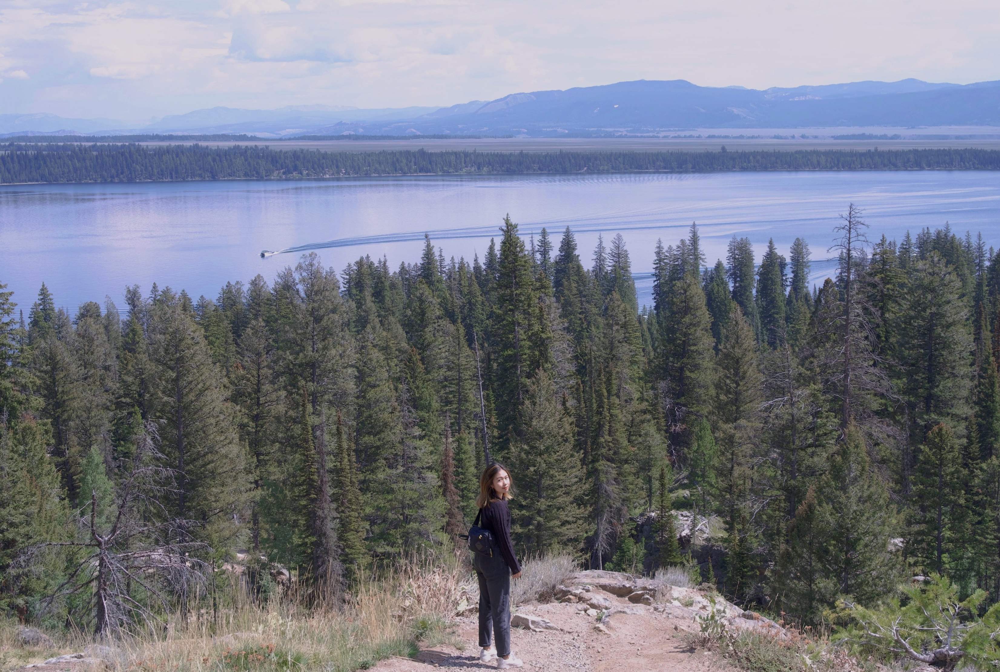

We did one random question in everyday standup meeting. Last week there was a question “What’d you do if you are on a talent show?”. 

When it was my round, I said I’m good at packing, there’s always something pops up at the very last minute that I can stuff it into my luggage that’s already full. 

My colleagues laughed.

- - - - - - - - - - - - - - - - - - - 

A week later, my yearly talent show begins - trying to pack clothes for all seasons into a carry-on. Traveling has so much fun, includes the step of packing. My first long travel was a 9-hour flight to Finland. I didn’t know what can be brought onto flight and what must be checked in. I was so nervous even asking for a cup of juice that time. 

Many years later, I find my own ways of packing. I can do solo trip, check bags, have random conversations with interesting strangers, and head to a new destination wearing my noise cancellation headphones with my spiritual music at background. I grow up.

I still keep some childish habits all the time, prefer sitting by the window and let the window shade open, staring outside hoping to spot something surprising and interesting. If there’s nothing, at least there are different shapes of shades created by trees and clouds.

- - - - - - - - - - - - - - - - - - - 

This year I am spending the longest summer I’ve ever had - almost 4 months. In the past 12 years, I spent every summer in the orchestra with some of the best people I've ever met - rehearsing, gaming, performing. This is the first one that I didn't do anything with them.

One year ago, I landed in Pittsburgh, started my new life in the US. The summer here is much hotter than I expected though it’s not that hot as Shanghai, but when the lights are shining, with all kinds of brake lights at the background, it would somehow remind me of Shanghai, such a weird feeling since they are so different.

The daytime is extremely long during summer as well, makes the time unrealistic and easily form into a bad night schedule. Sometimes I will just sit by the window, or stand still on street, watching the amazing 9pm sunset. Then another day passed, my productive night life begins.

- - - - - - - - - - - - - - - - - - - 

There’s one thing on my bucket list I really want to realize this year - freediving. I am craving to swim with all kinds of fish, watching them enjoy their life with all the freedom. That’d be so beautiful. Though in my deep mind I don’t know, I’m not good at swimming and somehow afraid of water in my deep heart. But I guess we should at least try to be good friends with our grand ocean, just like the mindset I used when I first surfed and kept falling down. “He just want to hug me!“ Then falling becomes interesting.

I will figure it out. Excited about the next talent show!

To the 2022 summer and upcoming journey:/

