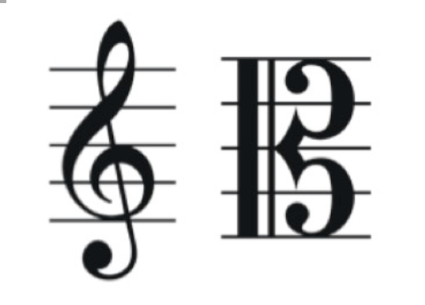

I won the audition for my orchestra when I was 11 years old, my viola teacher thought I should play the viola. At that time, I had never heard the sound of the viola before, nor did I even know what a viola is. All I knew was playing the violin, my world was quite small as well. 

Many people used to believe that those who switched to the viola were not skilled violinists. True, I really thought so. However, I never imagined how much the viola would transform my life.

### the first 1-2 years
In the first couple of years, I assumed that transitioning to the viola would be relatively easy since it's just one string different from the violin – the viola has A, D, G, C strings, one-fifth lower than the violin's E, A, D, G strings. Additionally, I only needed to learn how to read alto clef. Easy! It's like learning Python when you already know Java.

Meanwhile, I heard from my teacher, “you can get a job easier by playing the viola than violin, because fewer people study it”. That was probably one of the promotional points for me at very first stage.

It wasn't until I heard the viola's sound in a concert hall that I became truly captivated. My first viola, lent to me by the school, arrived in a vintage black wooden case.

However, the first several months were not that smooth as I expected.

The starting point was quite hard, I had to get use of the clef and the instrument in a relatively short time because there was the shortage of viola players 10 years ago. I remember I was asked to perform on a big stage playing William Tell Overture with the orchestra, but I could not even read the alto clef smoothly that what I could do is keeping my bowing correctly together with the whole viola section. 

On the bright side, this difficulty pushed me to improve. 

My viola teacher then spent almost 3 to 5 months only let me practice how to play on open strings alone.  She said although playing technique looks very similar to violin, they were totally different though, in terms of almost every aspect, to bring out of viola’s true character and resonance. 

The strings are thicker and more resistant to the bow, which means you have to give a stronger bow to produce sound. 

When we are playing the violin, we use right wrist a lot to manage the bow, but it’s better to use arm instead in viola. Apparently, it’s very difficult to change a habit which you’ve been getting used to it for 8 years.

Not to mention viola is heavier on my shoulders, plus I have to stretch my fingers and turn my arm more often in an exhausting way. 

- - - - - - - - - - - - - - - - - - - 
### after 3-4 years
After years of struggling, I started to realize what do those significant and subtle differences really mean in techniques. This was the stage where I started to playing a lot of pieces, aka cumulation. 

Thanks to my teacher, I got the chance to get exposed to different composers, different music era and different styles. Thanks to my orchestra, I gained more sense and feelings about the importance of violas in symphonies. I am proud of to be a viola player.

I also told everyone who is curious about viola that “When you touch the C string, you will never forget.” This was also the time I would explain a lot of differences between viola and violin, in a fundamental way. 

You cannot live without a viola. Viola often serves as a mediator, ang you need some violas to bring the ensemble together.  

I started to fall in love with classical music as well as the viola from my bottom of heart, finally, after almost 10 years of learning music. Even with the more intense academic work at school, I spent more time practicing every day and felt accomplished. 

- - - - - - - - - - - - - - - - - - - 
### after 5-7 years and till now
Now playing viola is all about bringing out its authentic voice and character. It’s always a skill need to practice and deserves exploration. There are lots of physical and mental aspects of viola playing. Dive with its sound, and I felt I’m finding its inner rhythmical sensibility more often. 

Viola can be so espressivo, touching, beautiful.

I considered whether I should apply for music conservatory very seriously in high school. For many reasons with some hesitations, I decided not to become a professional violist. But I appreciate all of the practices, training, rehearsing and the time on stages. To this day, I believe music opened up certain channels in my brain, allowing me to understand concepts, both in classroom, work as well as in daily life. 

When I looking back what my viola teacher told me at first, I did get my ideal offer when applying for college, probably a job as well. What if I didn’t choose to play the viola and continue the violin? 

I don’t know, but life will find its way.