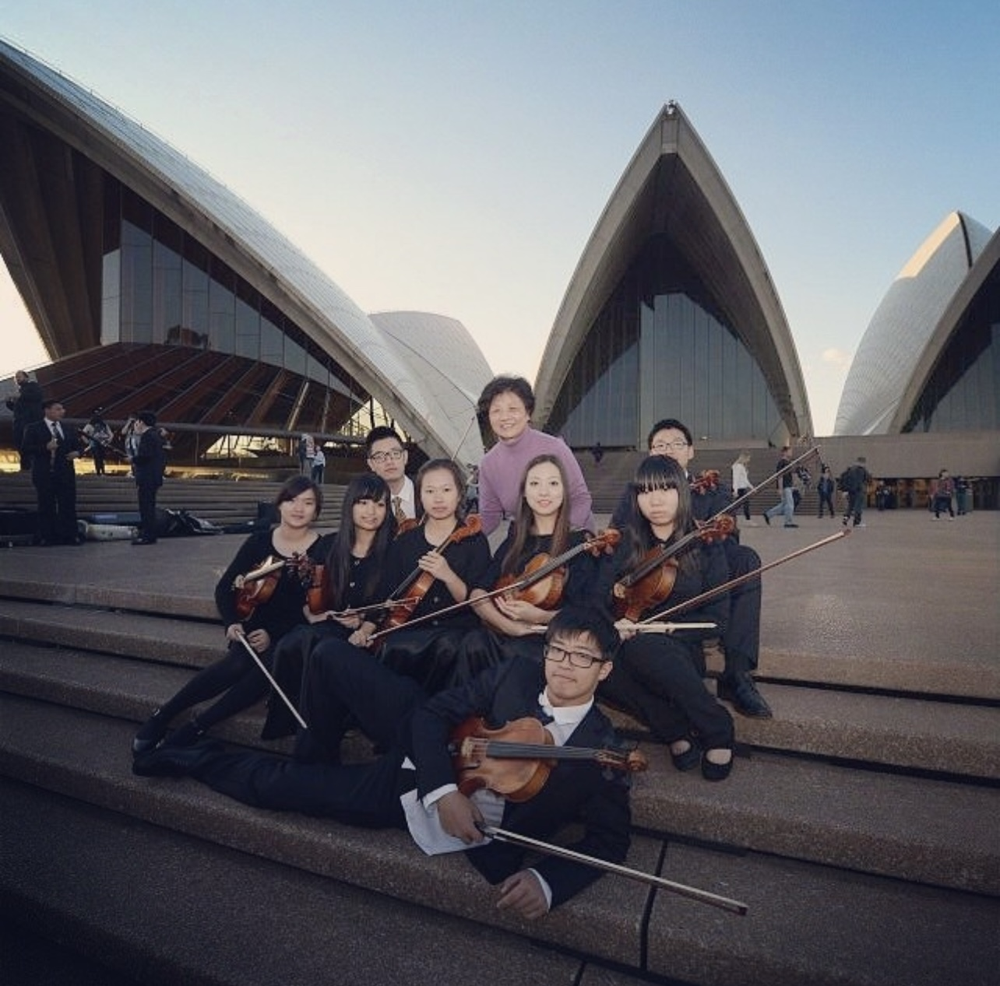
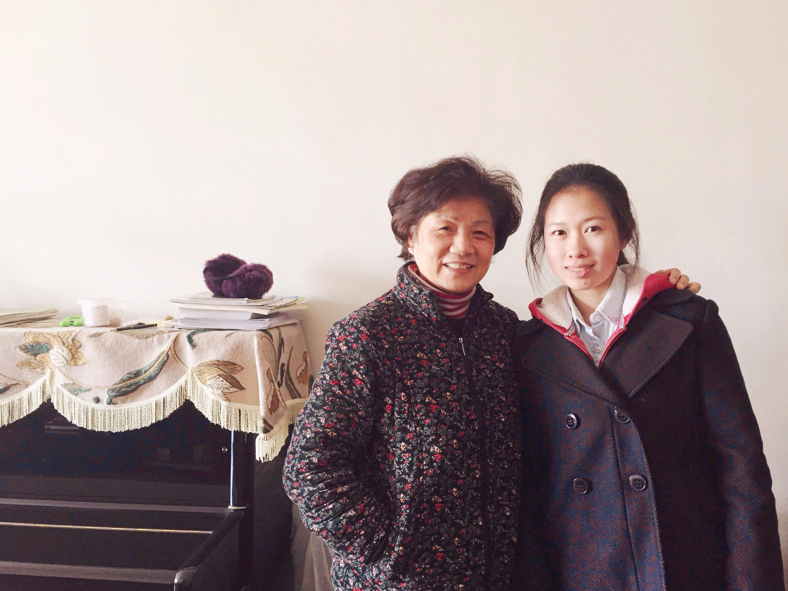

I am still in disbelief that you left us so suddenly. This year marks the 16th year of my journey as your student. In my 26 years of life, you have been a significant part, witnessing my growth, knowing my strengths and weaknesses, grasping my little thoughts, seeing my flaws, and encouraging me to showcase my best qualities.

In my heart, you embody the essence of the viola—resilient yet graceful, a perfect blend of elegance and strength, you seamlessly combined poetic beauty with grandeur.

I remember in 2009, when I first became your student, your grandson had not yet been born. Over the years, I watched him grow, start learning the piano and violin, and now he is a member of viola section of our orchestra.

In your lessons, you shared captivating stories from your own life, and how you learned to play the viola in China during the '70s and '80s. You told us about your first overseas performance and how you would buy yourself a memorable gift on each trip, like the dress you bought abroad when you were young, which still looks beautiful and never goes out of style.

We would even playing duets together. Those sessions were not only musically enriching but also deeply personal, memorable, and really special to me.

These two days, memories of those times have flooded my mind. Every Sunday morning, you would walk into the classroom with a smile, turning my weekly rehearsals into the highlight of my week despite the heavy academic workload in China, and this became the most exciting thing I always looked forward to throughout the entire seven years .

Although it is incredibly painful to accept your sudden departure, you taught me to embrace life with positivity and optimistic. So now, I will carry the love and joy you shared with me and live my life well.

Every time we were together, we have endless things to talk about, and there are always so many more we want to chat. Tomorrow is your funeral ceremony, I guess I’m saying an early farewell to you here. You always had a lovely side. Whenever I play the viola, I will think of you and your smile, and in those moments, you will be with me.

To my dearest teacher, I hope you are surrounded by beautiful melodies and love in another world. May the music there be as wonderful as the joy and wisdom you brought into our lives here.

You were loved by so many people, and your legacy will continue to live on through the music and the memories you left behind. I will always carry a part of you with me, and I will forever cherish the lessons and moments we shared.

I love you, and I will miss you dearly.

